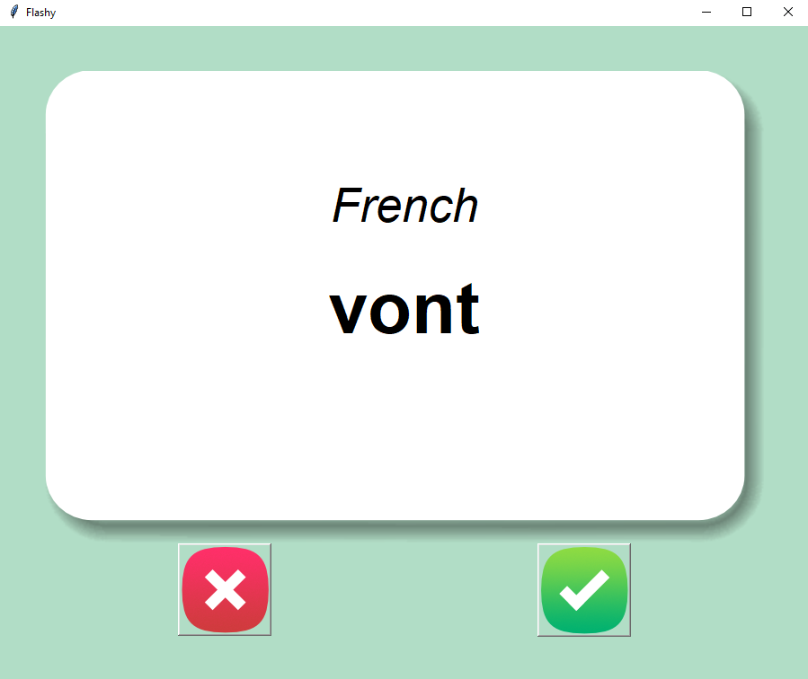
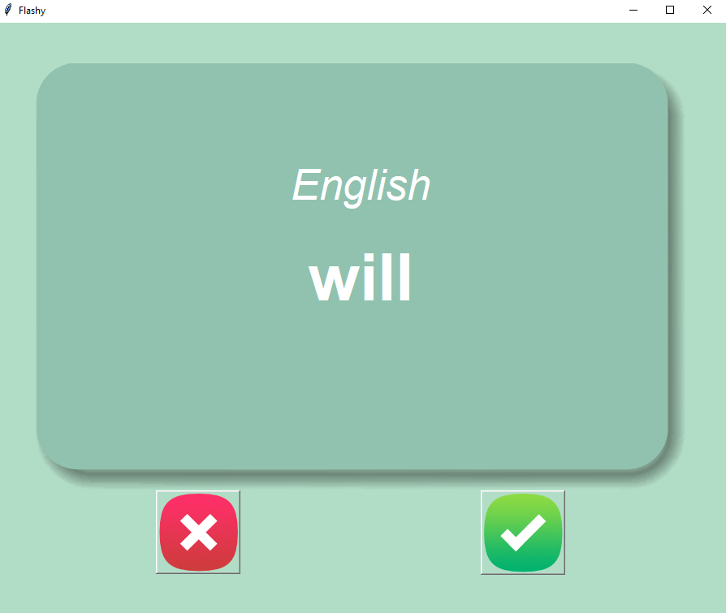

# Flash Card Program
A straightforward application designed to replicate the traditional method of studying using physical flashcards.

by [@ericczop](https://github.com/ericczop)

## Screenshots:

